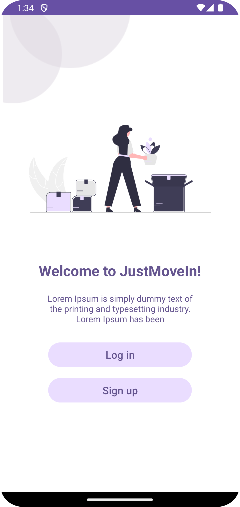

# CS 501 Final Project - JustMoveIn
> **Team**:   Jiayin Fan, Xiangyu Ji, Haixi Zhang 

*Whether we go to school or work in a new city, we need to solve the problem of renting a house
and purchasing furniture facilities. So we designed JustMovein, which is an app that combines rental housing and
second-hand purchase for both buying and selling. Make it easy for users to move in.*

  

## Compile Instructions
Please use `Get from VCS` in Android Studio, and enter https://github.com/e0c0h0o0/MovieinApplication.git as the URL to import the project.

## Storage and Database
JustMoveIn uses Firebase. a noSQL real-time database, for cloud real-time data storage.

## Architecture and Design
### 1. Welcome Activity (WelcomeActivity.kt & activity_welcome.xml)
A starter page of the application. When a user open the application, they will see an introduction and choices for logging in or signing up.
### 2. Log in Activity and Sign up Activity (LogInActivity.kt & activity_log_in.xml, SignUpActivity.kt & activity_sign_up.xml)
Activities for logging in and signing up an user account, which can be navigated to each other. Currently, signing up by Email and Password is supported. User account information is stored in Firebase.
### 3. Main Activity (MainActivity.kt & activity_main.xml) 
The main page of the application, including a search bar on top and a bottom navigation bar (Housing, Trading and Profile).
### 4. Trading Features
- A 3x3 recycler view for active trading items (TradeMainFragment.kt, ItemAdaper.kt & fragment_trade_main.xml, item_grid_layout.xml)
- Trading item detail page (ItemDetailActivity.kt & activity_item_detail.xml)
- Listing a new item page (ListItemActivity.xml & activity_list_item.xml)
- Item data object (item.kt)
### 5. Profile and Account Features
- A profile main page including user account information and settings (ProfileActivity.kt & activity_profile.xml)
- User data object (user.kt)

## Changes and Future Work
### Changes
1. For both item and subletting listing, the "Recently Viewed" tab as shown in storyboard is changed to "Liked". This change was made becuase it is more useful to the user, and also easier to manage.
2. The "Subscribe" (or "Sponsor") feature is considered to be removed.
### Future Work
1. App level (IMPORTANT)
- Save application state.
- Save the user's logging in state.
- UI style match.
2. Implementing the subletting feature.
- A 3x3 recycler view for active subletting listings/
- Subletting listing detail page.
- Listing a new subletting page.
- Housing data object.
3. For the trading section:
- Enable search by title.
- Enable filters by category, conditon and price range.
- Allow user to see and edit the item they listed.
- Implement "Share" and "Contact" features.
4. For user account and settings:
- Allow users to edit there user name and password.
- Add support for multiple languages.

## References
<a id="1">[1]</a> For Generative AI usage, please refer to the [References](Docs/References) folder.
